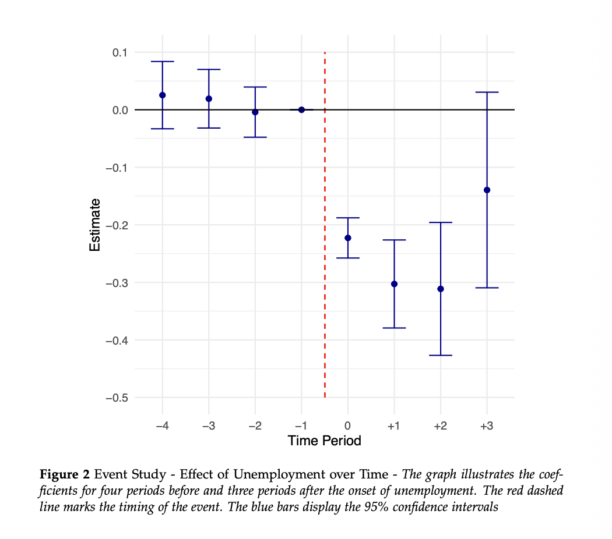

# Unemployment and Life Satisfaction: Evidence from UKHLS Panel Data
detailed summary see [Thesis_Summary.Rmd](https://github.com/mhuberdev/ukhls-lifeSatisfaction/blob/07c9964a6e3854237a03bc7c089b25da9e917891/thesis_summary.Rmd)

## Overview

This project examines how unemployment affects subjective well-being using UK Household Longitudinal Study (UKHLS) panel data. Code written in R.

## Research Question

How does unemployment affect life satisfaction over time?

## Data

The analysis uses UKHLS data. Raw data are not included in this repository because access is restricted through the UK Data Service.
https://ukdataservice.ac.uk/

## Methods

- Descriptive analysis
- Regression models (Two-way Fixed Effects (Staggered static DiD), Random Effects, Pooled OLS)
- Event-study design (Dynamic)

## Main Finding
### Main
Unemployment is associated as a main driver of purpose and with a substantial decline in life satisfaction.

### Relativity
Subjective well-being is not evaluated in purely absolute terms (also due to study design as setup evaluates CHANGE). People assess their situation relative to:
- their own past circumstances
- other people
- their expectations about life
This means that job loss does not reduce well-being only through lower income. It can also reduce relative status, disrupt identity, and weaken one’s perceived social position.

### Set-point theory
Set-point theory suggests that individuals tend to return, at least partly, to a baseline level of well-being after major life events.

For this thesis, the key point is: many life shocks show partial or substantial adaptation over time

unemployment appears different, because adaptation is often incomplete

### Implications
This makes unemployment especially important in well-being research. It suggests that job loss is not just a temporary negative shock, but may have a more persistent effect on life satisfaction than a simple set-point model would predict.

## Repository Structure

- `R/`: analysis scripts
- `outputs/`: selected figures and tables, tbd.
- `thesis_summary.Rmd`: narrative version of the analysis

## Reproducibility

The code is shared for transparency and workflow demonstration. Full replication requires authorized access to UKHLS data.

## Author

Michael Huber
